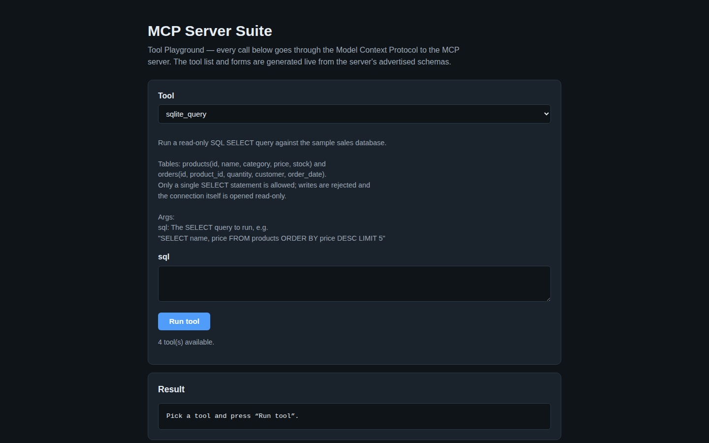
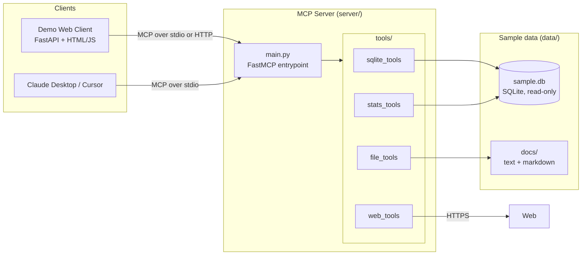

# MCP Server Suite

A complete, production-style **Model Context Protocol (MCP)** server with a
browser-based demo client. The server exposes real, useful tools over the
MCP protocol; the demo client discovers and calls them through the
protocol — never by importing tool code — so the same server works
unchanged with Claude Desktop, Cursor, or any other MCP client.

> **What is MCP?** The Model Context Protocol is an open standard for
> connecting AI applications to external tools and data. An MCP *server*
> advertises tools (with JSON schemas); an MCP *client* — an AI app, an
> IDE, or this demo — discovers them at runtime and calls them in a
> uniform way.

## Screenshots



The demo client's tool playground: the tool picker and input forms are generated live from the MCP server's advertised schemas (here `sqlite_query` is selected), and every call goes through the Model Context Protocol.

## Features

- **Four real tools** — read-only SQL queries, documentation search, web
  fetching with HTML-to-text cleaning, and revenue analytics.
- **Two transports** — stdio for local desktop clients, Streamable HTTP
  for containers and remote use.
- **Safety by design** — the database connection itself is opened
  read-only and every SQL statement is validated before execution.
- **Zero-config demo** — a seed script builds the sample database; the
  web playground generates its forms from the server's live tool schemas.
- **Clean architecture** — server, tools, and client are separate
  packages with configuration via environment variables.

## Architecture



## Tool catalogue

| Tool | Description | Key arguments |
| --- | --- | --- |
| `sqlite_query` | Run a read-only `SELECT` against the sample sales database (`products`, `orders`) and get a formatted table back. Writes and multi-statements are rejected. | `sql` (string) |
| `file_search` | Case-insensitive keyword search across the bundled docs (`data/docs`), returning matches with context lines. | `keyword` (string), `context_lines` (int, default 1) |
| `web_fetch` | Fetch a URL and return its readable text with scripts, styles, and markup stripped. | `url` (string) |
| `revenue_stats` | Top products by revenue (units sold, total revenue), or revenue aggregated by category. | `limit` (int, default 5), `by_category` (bool, default false) |

## Quick start (local)

```bash
# 1. Set up
python -m venv .venv
source .venv/bin/activate        # Windows: .venv\Scripts\activate
pip install -r requirements.txt

# 2. Create the sample database
python scripts/seed_db.py

# 3a. Try the web playground (spawns the server over stdio for you)
uvicorn client.main:app --port 8080
#     → open http://localhost:8080

# 3b. Or run the server standalone for your own MCP client
python -m server.main            # stdio transport

# 4. Verify everything end to end
python scripts/test_server.py
```

## Quick start (Docker)

```bash
docker compose up --build
# → playground: http://localhost:8080
# → MCP server (Streamable HTTP): http://localhost:8000/mcp
```

In this setup the client connects to the server over Streamable HTTP
instead of spawning it as a subprocess — same protocol, different
transport.

## Connect it to Claude Desktop / Cursor

Add the server to your MCP client configuration (Claude Desktop:
`claude_desktop_config.json`; Cursor: `.cursor/mcp.json`):

```json
{
  "mcpServers": {
    "mcp-server-suite": {
      "command": "python",
      "args": ["-m", "server.main"],
      "cwd": "/absolute/path/to/mcp-server-suite"
    }
  }
}
```

Restart the client, and the four tools appear automatically — the client
reads their names, descriptions, and parameter schemas from the server
during the protocol handshake.

## Example tool calls

**sqlite_query**
```json
{ "sql": "SELECT name, price FROM products WHERE category = 'Audio' ORDER BY price" }
```
```
name                     | price
-------------------------+------
Echo Chamber Speaker Mini | 59.99
Halo Noise-Cancel Earbuds | 79.99
Aurora Wireless Headphones | 129.99
(3 rows)
```

**revenue_stats** — `{ "limit": 3 }` returns the three best-selling
products by revenue, computed from `orders × products`.

**file_search** — `{ "keyword": "protocol", "context_lines": 1 }`
returns every matching line in the docs folder with its neighbours.

**web_fetch** — `{ "url": "https://example.com" }` returns the page's
main text, cleaned of markup.

## Project structure

```
mcp-server-suite/
├── server/
│   ├── main.py          # FastMCP entrypoint (stdio / Streamable HTTP)
│   ├── config.py        # Environment-based settings
│   ├── db.py            # Read-only SQLite access + result formatting
│   └── tools/           # One module per tool, each with register()
│       ├── sqlite_tools.py
│       ├── file_tools.py
│       ├── web_tools.py
│       └── stats_tools.py
├── client/
│   ├── main.py          # FastAPI demo app
│   ├── mcp_client.py    # MCP client (stdio + HTTP transports)
│   └── static/          # Playground UI (HTML / CSS / JS)
├── data/
│   └── docs/            # Sample documents for file_search
├── scripts/
│   ├── seed_db.py       # Creates data/sample.db
│   └── test_server.py   # End-to-end protocol smoke test
├── Dockerfile
├── docker-compose.yml
└── requirements.txt
```

## Configuration

All settings are environment variables (see `.env.example`):
`SAMPLE_DB_PATH`, `DOCS_DIR`, `WEB_FETCH_TIMEOUT`, `MAX_QUERY_ROWS`,
`MCP_TRANSPORT` (`stdio` | `http`), `MCP_SERVER_URL`, `MCP_PORT`.

## Adding your own tool

1. Create a module in `server/tools/` with a `register(mcp)` function.
2. Decorate functions with `@mcp.tool()` and write a clear docstring —
   it becomes the tool description clients (and AI models) see.
3. Add the module to `register_all` in `server/tools/__init__.py`.

Every client picks the new tool up automatically on the next handshake.

## License

MIT

---
**More projects by Nisar Ahmad** — [GitHub profile](https://github.com/nisarahmad78) · [Portfolio site](https://nisarahmad78.github.io)
- [VOCALIQ — AI Voice Customer Experience Platform](https://github.com/nisarahmad78/VOCALIQ)
- [RAG Document Q&A](https://github.com/nisarahmad78/rag-document-qa)
- [LangGraph AI Agent](https://github.com/nisarahmad78/langgraph-ai-agent)
- [MCP Server Suite](https://github.com/nisarahmad78/mcp-server-suite)
- [AI Support Desk](https://github.com/nisarahmad78/ai-support-desk)
- [LLM Gateway](https://github.com/nisarahmad78/llm-gateway)
